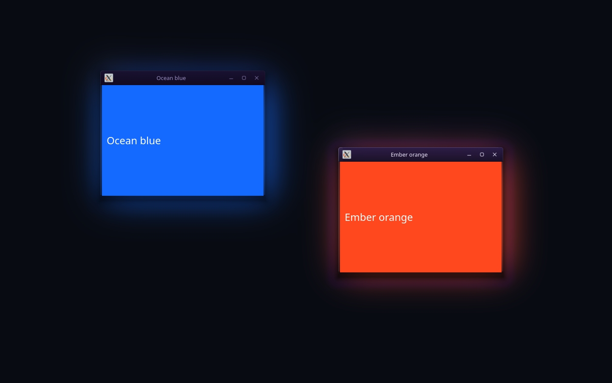

# nx glow

Experimental native KWin effect that lets window content influence a soft desktop glow. Built against KWin 6.7.5 headers; this project is early and has not been validated for multi-monitor or HDR setups. Full-damage redraw cost has not been benchmarked.

Showcase: [nerdrx.github.io/nx-glow](https://nerdrx.github.io/nx-glow/).



The glow uses a quarter-resolution floating-point scene and a contiguous Gaussian kernel, with paired texture taps for smooth gradients even at maximum radius. Updates load without restarting KWin.

## Build and install

### NX Hub

Refresh NX Hub, find **nx glow**, and install **KDE Plasma effect + settings**. The release includes `nx-app.json`, so Hub discovers the package without a Hub update.

Then open **nx glow settings → Install / repair effect**, or use Hub's **Run** action for the setup command. Setup compiles against your installed KWin headers and requests your system password to install the native plugin. On Arch/CachyOS it also installs missing build dependencies. Repeat setup after updating the Hub package or KWin.

Hub manages the user package; the system plugin needs separate removal. Before uninstalling through Hub, run `~/.local/share/nx-glow/uninstall.sh --gui`.

### From source

Run `./install.sh` (terminal authentication) or `./install.sh --gui` (desktop authentication) as your user. It builds locally and elevates only dependency installation and the plugin copy. Arch/CachyOS dependencies are installed as needed; other distributions need their equivalent KWin, Qt, KDE Frameworks, CMake, compiler, Vulkan headers, and PySide6 development/runtime packages.

Open **System Settings → Desktop Effects → nx glow → Configure** for the native size, brightness and colour controls. Apply saves changes; Reset restores defaults. Reopen the Desktop Effects page after installation if it was already open.

Setup also adds **nx glow settings** to your application menu. It provides live glow size, brightness, colour intensity, enable/disable, and reset. You can also launch it with `nx-glow-settings`.

To build without installing, run `cmake -S . -B build && cmake --build build`. After KWin ABI updates, rebuild and reinstall the effect.

Tune the glow in `kwinrc` under `[Effect-nxglow]`: `Radius` defaults to `110` (range `10–300`); `Strength` defaults to `0.85` and `Saturation` to `1` (both range `0–2`). Set values with `kwriteconfig6`, then apply changes with `qdbus6`:

```sh
kwriteconfig6 --file kwinrc --group Effect-nxglow --key Radius 110
kwriteconfig6 --file kwinrc --group Effect-nxglow --key Strength 0.85
kwriteconfig6 --file kwinrc --group Effect-nxglow --key Saturation 1
qdbus6 org.kde.KWin /Effects org.kde.kwin.Effects.reconfigureEffect nxglow
```

Remove it with `./uninstall.sh` or `./uninstall.sh --gui`. Do not run the entire script as root.

## Smoke test

`tests/smoke.sh` runs a disposable KWin session inside headless Gamescope, captures baseline, active, changed-content, and minimized-window frames, then checks the screenshots with `tests/check.py`. It needs Gamescope, KWin, D-Bus, Qt/PySide6, python-xlib, Pillow, and Spectacle. The screenshots and log go to `test-output/` and are local test artifacts, not project recordings.

It also verifies live radius, brightness and saturation changes. The Qt control test uses an isolated fake config/KWin boundary:

```sh
timeout -k 3 20 gamescope --backend headless -W 800 -H 700 -- env QT_QPA_PLATFORM=xcb python tests/settings_smoke.py
```

Build the source bundle with `./package.sh`. Test it against an NX Hub checkout with `node tests/hub.cjs /path/to/nx-hub dist/nx-glow-0.1.2-linux.tar.gz`; this invokes Hub's real manifest validator and install/uninstall engine in temporary directories.

## License

GPL-2.0-or-later. See [LICENSE](LICENSE).

Native settings plugin validation: `tests/config-smoke.sh` builds and loads the real KCModule, checks save/defaults/reload, and renders it inside hidden Gamescope with an isolated configuration and D-Bus session.
